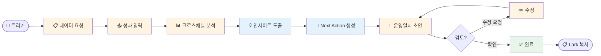

# 나의 워크샵 스킬 설계서

> 📋 **이 설계서는 [사전설문응답.md](사전설문응답.md) 인터뷰를 바탕으로 작성되었습니다.**

> ⚠️ **이 설계서는 초안입니다!**
>
> 정답이 아니에요. 워크샵 당일 강사님과 함께 범위를 더 좁히거나, 더 구체화할 수 있습니다.
>
> **사전과제의 목적**:
> 1. 스킬을 설치해서 한 번 써본 것 ✅
> 2. 나만의 스킬 설계서를 만들어서 "아, 내 작업이 이렇게 자동화되겠구나", "이런 흐름이겠구나" 감 잡기 ✅
>
> 이 정도면 충분해요! 나머지는 워크샵에서 함께 다듬어봐요 😊

## 목차
- [0. 선언](#0-선언)
- [한눈에 보기](#한눈에-보기)
- [Core (필수)](#core-필수)
  - [1. 언제 쓰나요?](#1-언제-쓰나요)
  - [2. 사용법](#2-사용법)
  - [3. 입력/출력 명세](#3-입력출력-명세)
  - [4. 범위](#4-범위)
  - [5. 데이터/도구/권한](#5-데이터도구권한)
  - [6. 실패/예외 처리](#6-실패예외-처리)
  - [7. 대화 시나리오](#7-대화-시나리오)
  - [8. 테스트 & 완료 기준](#8-테스트--완료-기준)
- [🗺️ 발전 로드맵](#️-발전-로드맵)

---

## 0. 선언

- **스킬 이름**: daily-ops-log
- **한 줄 설명**: YouTube 채널 성과 데이터를 기반으로 인사이트와 Next Action을 포함한 일일 운영일지를 자동 생성하여 Lark MCP로 업로드
- **만드는 사람**: User Growth PM
- **스킬 유형**:
  - Phase 1 (MVP): [x] 텍스트 변환
  - Phase 2: [x] 외부 API (YouTube 데이터 수집)
  - Phase 3: [x] MCP 연동 (Lark MCP 자동 업로드)
- **MVP 목표 (Phase 1)**: "YouTube 채널별 성과 데이터를 입력하면 **인사이트 & Next Action**이 포함된 운영일지가 마크다운으로 생성되어 Lark에 바로 붙여넣을 수 있는 것"
- **최종 목표**: "YouTube Data API에서 데이터를 자동 수집하고, 인사이트 & Next Action을 분석하여, Lark MCP를 통해 Lark 문서에 자동 업로드하는 완전 자동화 워크플로우"

---

## 한눈에 보기

### 외부 연동

#### Phase 1 (MVP): 외부 연동 없음 ✅
별도 외부 연동 없이 바로 사용 가능합니다.

#### Phase 2: YouTube API
- **YouTube Data API v3** (영상 성과 데이터 자동 수집)

#### Phase 3: Lark MCP
- **Lark MCP** (Model Context Protocol을 통한 Lark 문서 자동 생성 및 업로드)

### 워크플로 시각화

> 💡 **다이어그램이 안 보이나요?**
>
> VSCode에서 Mermaid 다이어그램을 보려면 확장 프로그램이 필요해요:
> 1. VSCode 왼쪽 사이드바에서 **확장(Extensions)** 아이콘 클릭 (또는 `Cmd+Shift+X`)
> 2. `Markdown Preview Mermaid Support` 검색
> 3. **Install** 클릭
> 4. 이 파일을 다시 열고 **미리보기**(`Cmd+Shift+V`)로 확인!



---

## Core (필수)

### 1. 언제 쓰나요?

**대표 상황**:
매일 업무 마무리 시점에, 3-4개 YouTube 채널(AI 크리에이터별)의 성과를 정리하고 운영일지를 작성할 때.

**왜 필요한가** (불편/비용/시간):
- 3-4개 YouTube 채널의 성과 데이터를 YouTube Studio에서 각각 직접 확인해야 함
- 숫자 확인 후 콘텐츠별 장단점 분석과 인사이트까지 직접 작성해야 하므로 매일 상당한 시간 소요
- 반복적인 포맷 작성에 시간을 쓰는 대신, 분석과 전략에 집중하고 싶음
- 최종적으로는 Lark 문서에 자동으로 업로드되어 팀과 바로 공유하고 싶음

### 2. 사용법

**이렇게 부르면**:
- `/daily-ops-log`
- "운영일지 작성해줘"
- "오늘 성과 정리해줘"

**결과물 형태**: [x] 메시지  [ ] 파일  [ ] 링크/리포트  [ ] 기타

**결과물 예시**:
> ```
> # 📊 YouTube 일일 운영일지 — 2026-02-05
>
> ## 오늘 업로드한 콘텐츠
> | 크리에이터 | 콘텐츠 제목 | 영상 길이 |
> |-----------|------------|----------|
> | 크리에이터A | "AI로 작곡하기" | 12:34 |
> | 크리에이터B | "ChatGPT로 블로그 쓰기" | 8:45 |
> | 크리에이터C | "AI 이미지 생성 꿀팁" | 15:20 |
> | ...
>
> ## 채널별 성과 요약
> | 크리에이터 | 조회수 | 좋아요 | 댓글 | 구독자 증가 | 특이사항 |
> |-----------|--------|--------|------|-----------|---------|
> | 크리에이터A | 12,500 | 890 | 45 | +120 | 평균 대비 +40% |
> | 크리에이터B | 8,900 | 560 | 32 | +85 | - |
> | 크리에이터C | 15,200 | 1,200 | 67 | +180 | 급상승 |
> | ...
>
> ## 콘텐츠별 분석
> ### 크리에이터A — "AI로 작곡하기"
> - ✅ 강점: 도입부 후킹이 강해 시청지속률 높음 (평균 65%)
> - ⚠️ 약점: 후반부 이탈률 상승, CTA 위치 조정 필요
> - 💡 인사이트: 음악 관련 AI 콘텐츠 수요 확인, 시리즈화 검토
>
> ### 크리에이터C — "AI 이미지 생성 꿀팁"
> - ✅ 강점: 썸네일 클릭률 12% (평균 8%), 실용적인 꿀팁 콘텐츠 반응 좋음
> - ⚠️ 약점: 영상 길이가 다소 길어 중반부 이탈 발생
> - 💡 인사이트: 이미지 생성 AI 관심도 높음, 실습 위주 콘텐츠 강세
>
> ## 종합 인사이트
> - 오늘 전체적으로 실용적인 "꿀팁" 콘텐츠 성과가 높음
> - 크리에이터C의 채널이 급성장 중 (구독자 증가율 +180)
> - AI 콘텐츠 중 음악/이미지 생성 관련 주제가 가장 높은 반응
>
> ## 🎯 Next Action
> ### 즉시 실행 (24시간 이내)
> - [ ] 크리에이터A "AI로 작곡하기" 영상 CTA 위치 변경 (8분 → 6분)
> - [ ] 크리에이터C 급상승 요인 분석 회의 예약
>
> ### 단기 실행 (이번 주)
> - [ ] AI 음악 콘텐츠 시리즈 기획안 작성 (크리에이터A)
> - [ ] "꿀팁" 포맷 콘텐츠 기획 (전체 크리에이터)
> - [ ] 썸네일 A/B 테스트 계획 수립
>
> ### 중장기 모니터링
> - [ ] 크리에이터C 성장 트렌드 주간 추적 (2주)
> - [ ] 시청지속률 높은 콘텐츠 패턴 분석 (월간)
> - [ ] 크리에이터별 강점 주제 파악 후 콘텐츠 전략 조정
> ```

### 3. 입력/출력 명세

| 구분 | 내용 |
|------|------|
| **사용자 입력** | 오늘 업로드한 YouTube 영상 목록 + 채널별 성과 데이터 (텍스트로 자유롭게 입력) |
| **필수 옵션** | 크리에이터명, 영상 제목, 핵심 지표 (조회수, 좋아요, 댓글, 구독자 증가 등) |
| **선택 옵션** | 시청지속률, 썸네일 클릭률, 영상 길이, 특이사항, 이전 데이터와 비교 요청 |
| **출력 규칙** | 마크다운 포맷, Lark에 붙여넣기 가능한 형태, 날짜 자동 포함 |
| **출력 필수 섹션** | ① 업로드 콘텐츠 ② 성과 요약 ③ 콘텐츠별 분석 ④ 종합 인사이트 ⑤ **Next Action** (즉시/단기/중장기) |

### 4. 범위

#### Phase 1: MVP (워크샵 목표) ⭐
**하는 것**:
1. 입력된 YouTube 성과 데이터를 정해진 양식의 운영일지로 구조화
2. 콘텐츠별 장단점 분석 및 개선 포인트 제시
3. 크로스 크리에이터 비교 인사이트 도출
4. **즉시/단기/중장기 Next Action 자동 생성** (체크리스트 형태)

**안 하는 것** (Phase 2, 3에서 구현):
1. YouTube API에서 직접 성과 데이터 수집 (사용자가 직접 입력)
2. Lark 문서에 자동 업로드 (사용자가 복사/붙여넣기)

#### Phase 2: YouTube API 자동 수집 (워크샵 이후)
**하는 것**:
1. YouTube Data API v3 연동으로 영상 성과 자동 수집
   - 조회수, 좋아요, 댓글 수
   - 영상 길이, 게시 시간
   - 구독자 증가 추이
2. YouTube Analytics API 연동으로 심화 지표 수집
   - 시청지속률 (Average View Duration)
   - 썸네일 클릭률 (CTR)
   - 트래픽 소스 분석
3. 이전 운영일지 데이터 참고해서 전일/전주 대비 트렌드 비교

**필요한 것**:
- Google Cloud Platform 프로젝트 생성
- YouTube Data API v3 활성화 및 API 키 발급
- YouTube Analytics API 활성화 및 OAuth 2.0 인증
- 채널 ID 매핑 (크리에이터명 ↔ YouTube 채널 ID)

#### Phase 3: Lark MCP 자동 업로드 (장기 목표)
**하는 것**:
1. **Lark MCP 연동**으로 생성된 운영일지를 Lark 문서에 자동 생성 및 업로드
2. 크리에이터별 주간/월간 종합 리포트 자동 생성
3. 알림 자동화 (중요 지표 변동 시 Lark 메시지)
4. 스케줄러 연동 (매일 정해진 시간에 자동 실행)

**필요한 것**:
- Lark MCP 설정 및 연동 (Model Context Protocol)
- Lark 문서 템플릿 ID
- Lark 봇 권한 설정 (문서 생성/수정 권한)

### 5. 데이터/도구/권한

#### Phase 1 (MVP)
| 항목 | 내용 |
|------|------|
| **읽는 데이터** | 사용자가 대화로 입력하는 YouTube 성과 데이터 |
| **쓰는 위치** | 터미널 출력 (마크다운 텍스트) |
| **외부 서비스** | 없음 |
| **민감정보** | 없음 |

#### Phase 2 (YouTube API 자동 수집)
| 항목 | 내용 |
|------|------|
| **읽는 데이터** | YouTube Data API v3, YouTube Analytics API 성과 데이터 |
| **필요한 권한** | YouTube API 키 + OAuth 2.0 인증 (read-only) |
| **민감정보** | Google API 키, OAuth 클라이언트 시크릿 (환경변수로 관리) |
| **사용 도구** | Google Cloud Console, YouTube API Client Libraries |

#### Phase 3 (Lark MCP 자동 업로드)
| 항목 | 내용 |
|------|------|
| **쓰는 위치** | Lark 문서 (MCP를 통한 자동 업로드) |
| **필요한 권한** | Lark MCP 연동, Lark 봇 문서 쓰기 권한 |
| **민감정보** | Lark MCP 설정 정보, 문서 템플릿 ID |
| **사용 도구** | Lark MCP (Model Context Protocol) |

### 6. 실패/예외 처리

**예상되는 실패 상황**:
1. 성과 데이터 없이 트리거만 실행한 경우
2. 일부 크리에이터 또는 일부 채널 데이터만 입력한 경우
3. 숫자 없이 "오늘 성과 좋았어" 같은 모호한 입력

**실패 시 안내 원칙**:
- 데이터 없을 때: 어떤 정보가 필요한지 구체적으로 안내하고, 입력 예시를 보여줌
- 부분 데이터: 있는 데이터로 먼저 초안을 작성하고, 빠진 부분을 알려줌
- 모호한 입력: 구체적인 숫자를 요청하되, 정성적 코멘트도 인사이트 섹션에 반영

### 7. 대화 시나리오

**정상 케이스**:

**나**: "운영일지 작성해줘"

**스킬**:
> 오늘 YouTube 운영일지를 작성할게요! 아래 정보를 알려주세요:
>
> 1. 오늘 업로드한 영상 (크리에이터별, 영상 제목)
> 2. 채널별 주요 성과 (조회수, 좋아요, 댓글, 구독자 증가 등)
>
> 자유롭게 텍스트로 알려주셔도 되고, 표로 붙여넣으셔도 돼요!

**나**: "크리에이터A 'AI로 작곡하기' 조회수 12500 좋아요 890 댓글 45 구독자 +120, 크리에이터B 'ChatGPT로 블로그 쓰기' 조회수 8900 좋아요 560 댓글 32 구독자 +85, 크리에이터C 'AI 이미지 생성 꿀팁' 조회수 15200 좋아요 1200 댓글 67 구독자 +180..."

**스킬**:
> (위의 결과물 예시와 같은 구조화된 운영일지 출력)
> - 채널별 성과 요약 테이블
> - 콘텐츠별 분석 (강점/약점/인사이트)
> - 종합 인사이트
> - **🎯 Next Action** (즉시/단기/중장기 체크리스트)
>
> Lark에 복사하셨나요? 수정이 필요한 부분이 있으면 알려주세요!

---

**실패 케이스**:

**나**: "오늘 성과 정리해줘"  *(데이터 없이)*

**스킬**:
> YouTube 운영일지를 작성하려면 오늘의 성과 데이터가 필요해요!
>
> 이런 식으로 알려주시면 돼요:
> ```
> 크리에이터A "AI로 작곡하기"
> - 조회수: 12500, 좋아요: 890, 댓글: 45, 구독자 증가: +120
>
> 크리에이터B "ChatGPT로 블로그 쓰기"
> - 조회수: 8900, 좋아요: 560, 댓글: 32, 구독자 증가: +85
> ```
>
> YouTube Studio에서 숫자 확인하신 후 알려주세요!

### 8. 테스트 & 완료 기준

**테스트 체크리스트 (Phase 1 MVP)**:
- [ ] 기본: 3-4개 YouTube 채널 데이터 입력 → 운영일지 생성
- [ ] 부분 데이터: 일부 채널만 입력 → 있는 데이터로 분석 + 빠진 부분 안내
- [ ] 데이터 없이 트리거 → 입력 안내 메시지 출력
- [ ] **Next Action 생성**: 즉시/단기/중장기 액션이 체크리스트 형태로 출력
- [ ] **인사이트 품질**: 단순 숫자 나열이 아닌, 실행 가능한 분석 포함
- [ ] 출력 마크다운을 Lark에 붙여넣었을 때 깨지지 않는지 확인

**Done 기준 (Phase 1)**:
"3-4개 YouTube 채널 성과 데이터를 텍스트로 입력했을 때, 콘텐츠별 장단점 분석, 크로스 크리에이터 인사이트, **그리고 즉시/단기/중장기 Next Action**이 포함된 운영일지가 마크다운으로 출력되어 Lark에 바로 복사할 수 있는 것"

---

## 🗺️ 발전 로드맵

### Phase 1: MVP (워크샵에서 완성) ⭐
**목표**: 수동 입력 → 인사이트 & Next Action 자동 생성
- [x] YouTube 채널별 성과 데이터 구조화
- [x] 콘텐츠별 장단점 분석
- [x] 크로스 크리에이터 인사이트 도출
- [x] **Next Action 자동 생성** (즉시/단기/중장기)
- [x] Lark 복사 가능한 마크다운 출력

**예상 작업 시간**: 워크샵 1회 (2-3시간)

### Phase 2: YouTube API 자동 수집 (워크샵 이후)
**목표**: YouTube API 연동으로 데이터 자동 수집
- [ ] YouTube Data API v3 연동 (기본 성과 지표)
  - 조회수, 좋아요, 댓글, 구독자 증가
- [ ] YouTube Analytics API 연동 (심화 지표)
  - 시청지속률, 썸네일 클릭률, 트래픽 소스
- [ ] 이전 운영일지 데이터 참고 (전일/전주 대비 비교)
- [ ] 채널 ID 매핑 설정 (크리에이터명 ↔ YouTube 채널 ID)

**예상 작업 시간**: 2-3주 (Google API 인증 + 개발 + 테스트)

**필요 사전 작업**:
- Google Cloud Platform 프로젝트 생성
- YouTube Data API v3 및 Analytics API 활성화
- OAuth 2.0 클라이언트 ID 발급
- 채널 ID 수집 및 매핑 테이블 작성

### Phase 3: Lark MCP 자동 업로드 (장기 목표)
**목표**: End-to-End 자동화 (트리거 한 번으로 완료)
- [ ] **Lark MCP 연동**으로 Lark 문서 자동 생성 및 업로드
- [ ] 주간/월간 종합 리포트 자동 생성
- [ ] 중요 지표 변동 시 Lark 메시지 알림 자동 전송
- [ ] 스케줄러 연동 (매일 정해진 시간에 자동 실행)

**예상 작업 시간**: 1-2주 (Lark MCP 설정 + 스케줄링)

**필요 사전 작업**:
- Lark MCP (Model Context Protocol) 설정 및 연동
- Lark 문서 템플릿 생성
- Lark 봇 권한 설정 (문서 생성/수정 권한)

---

### 각 Phase별 트리거 사용법

| Phase | 트리거 | 입력 | 출력 |
|-------|--------|------|------|
| **Phase 1** | `/daily-ops-log` | YouTube 성과 데이터 (수동) | 운영일지 (터미널 마크다운) |
| **Phase 2** | `/daily-ops-log --auto` | 없음 (YouTube API 자동 수집) | 운영일지 (터미널 마크다운) |
| **Phase 3** | `/daily-ops-log --publish` | 없음 (YouTube API + Lark MCP) | 운영일지 (Lark 문서 자동 생성) |

---

## 배포 준비 (워크샵 후)

워크샵에서 스킬을 완성한 후, GitHub에 배포하여 다른 사람도 사용할 수 있게 합니다.

### 필요한 파일

| 파일 | 상태 | 설명 |
|------|------|------|
| `SKILL.md` | [ ] 미완성 | 스킬 정의 (워크샵에서 작성) |
| `README.md` | [ ] 자동생성 예정 | 설치 가이드 (배포 시 자동 생성) |

### 배포 방법

워크샵에서 스킬을 완성한 후, Claude Code에게 말하세요:

```
이 스킬 배포해줘
```

Claude Code가 자동으로:
1. README.md 생성 (설치 방법 + 사용법 가이드)
2. GitHub 레포 생성
3. 설치 명령어 안내

---

**워크샵 당일 이 설계서 가져오세요!**
