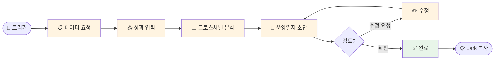

# 나의 워크샵 스킬 설계서

> 📋 **이 설계서는 [사전설문응답.md](사전설문응답.md) 인터뷰를 바탕으로 작성되었습니다.**

> ⚠️ **이 설계서는 초안입니다!**
>
> 정답이 아니에요. 워크샵 당일 강사님과 함께 범위를 더 좁히거나, 더 구체화할 수 있습니다.
>
> **사전과제의 목적**:
> 1. 스킬을 설치해서 한 번 써본 것 ✅
> 2. 나만의 스킬 설계서를 만들어서 "아, 내 작업이 이렇게 자동화되겠구나", "이런 흐름이겠구나" 감 잡기 ✅
>
> 이 정도면 충분해요! 나머지는 워크샵에서 함께 다듬어봐요 😊

## 목차
- [0. 선언](#0-선언)
- [한눈에 보기](#한눈에-보기)
- [Core (필수)](#core-필수)
  - [1. 언제 쓰나요?](#1-언제-쓰나요)
  - [2. 사용법](#2-사용법)
  - [3. 입력/출력 명세](#3-입력출력-명세)
  - [4. 범위](#4-범위)
  - [5. 데이터/도구/권한](#5-데이터도구권한)
  - [6. 실패/예외 처리](#6-실패예외-처리)
  - [7. 대화 시나리오](#7-대화-시나리오)
  - [8. 테스트 & 완료 기준](#8-테스트--완료-기준)
- [나중에 더 발전시킬 아이디어](#나중에-더-발전시킬-아이디어)

---

## 0. 선언

- **스킬 이름**: daily-ops-log
- **한 줄 설명**: 멀티채널 소셜미디어 성과 데이터를 기반으로 콘텐츠별 분석과 인사이트를 포함한 일일 운영일지 초안을 자동 생성
- **만드는 사람**: User Growth PM
- **스킬 유형**: [x] 텍스트 변환  [ ] 파일 기반  [ ] 외부 API  [ ] 다단계 워크플로우
- **MVP 목표**: "채널별 성과 데이터를 입력하면 콘텐츠별 장단점 분석이 포함된 운영일지 초안이 마크다운으로 생성되는 것"

---

## 한눈에 보기

### 외부 연동

별도 외부 연동 없이 바로 사용 가능합니다.

### 워크플로 시각화

> 💡 **다이어그램이 안 보이나요?**
>
> VSCode에서 Mermaid 다이어그램을 보려면 확장 프로그램이 필요해요:
> 1. VSCode 왼쪽 사이드바에서 **확장(Extensions)** 아이콘 클릭 (또는 `Cmd+Shift+X`)
> 2. `Markdown Preview Mermaid Support` 검색
> 3. **Install** 클릭
> 4. 이 파일을 다시 열고 **미리보기**(`Cmd+Shift+V`)로 확인!



---

## Core (필수)

### 1. 언제 쓰나요?

**대표 상황**:
매일 업무 마무리 시점에, 유튜브·틱톡·인스타그램 9-12개 채널(AI 크리에이터 3-4명 × 3개 플랫폼)의 성과를 정리하고 운영일지를 작성할 때.

**왜 필요한가** (불편/비용/시간):
- 9-12개 채널의 성과 데이터를 각각의 스튜디오에서 직접 확인해야 함
- 숫자 확인 후 콘텐츠별 장단점 분석과 인사이트까지 직접 작성해야 하므로 매일 상당한 시간 소요
- 반복적인 포맷 작성에 시간을 쓰는 대신, 분석과 전략에 집중하고 싶음

### 2. 사용법

**이렇게 부르면**:
- `/daily-ops-log`
- "운영일지 작성해줘"
- "오늘 성과 정리해줘"

**결과물 형태**: [x] 메시지  [ ] 파일  [ ] 링크/리포트  [ ] 기타

**결과물 예시**:
> ```
> # 📊 일일 운영일지 — 2026-02-05
>
> ## 오늘 업로드한 콘텐츠
> | 크리에이터 | 플랫폼 | 콘텐츠 제목 |
> |-----------|--------|------------|
> | 크리에이터A | YouTube | "AI로 작곡하기" |
> | 크리에이터A | TikTok | "AI로 작곡하기 (숏폼)" |
> | ...
>
> ## 채널별 성과 요약
> | 크리에이터 | 플랫폼 | 조회수 | 좋아요 | 댓글 | 특이사항 |
> |-----------|--------|--------|--------|------|---------|
> | 크리에이터A | YouTube | 12,500 | 890 | 45 | 평균 대비 +40% |
> | ...
>
> ## 콘텐츠별 분석
> ### 크리에이터A — "AI로 작곡하기"
> - ✅ 강점: 도입부 후킹이 강해 시청지속률 높음
> - ⚠️ 약점: 후반부 이탈률 상승, CTA 위치 조정 필요
> - 💡 인사이트: 음악 관련 AI 콘텐츠 수요 확인, 시리즈화 검토
>
> ## 종합 인사이트
> - 오늘 전체적으로 숏폼 성과가 롱폼 대비 높았음
> - 크리에이터B의 틱톡 채널 성장세 주목
> ```

### 3. 입력/출력 명세

| 구분 | 내용 |
|------|------|
| **사용자 입력** | 오늘 업로드한 영상 목록 + 채널별 성과 데이터 (텍스트로 자유롭게 입력) |
| **필수 옵션** | 크리에이터명, 플랫폼, 핵심 지표 (조회수, 좋아요, 댓글 등) |
| **선택 옵션** | 시청지속률, 구독자 변화, 특이사항, 이전 데이터와 비교 요청 |
| **출력 규칙** | 마크다운 포맷, Lark에 붙여넣기 가능한 형태, 날짜 자동 포함 |

### 4. 범위

**하는 것** (3개 이내):
1. 입력된 성과 데이터를 정해진 양식의 운영일지 초안으로 구조화
2. 콘텐츠별 장단점 분석 및 개선 포인트 제시
3. 크로스채널/크로스크리에이터 비교 인사이트 도출

**안 하는 것** (2개 이내):
1. 각 플랫폼 API에서 직접 성과 데이터 수집 (사용자가 직접 입력)
2. Lark 문서에 자동 업로드 (사용자가 복사/붙여넣기)

### 5. 데이터/도구/권한

| 항목 | 내용 |
|------|------|
| **읽는 데이터** | 사용자가 대화로 입력하는 성과 데이터 |
| **쓰는 위치** | 터미널 출력 (마크다운 텍스트) |
| **외부 서비스** | 없음 |
| **민감정보** | 없음 |

### 6. 실패/예외 처리

**예상되는 실패 상황**:
1. 성과 데이터 없이 트리거만 실행한 경우
2. 일부 크리에이터 또는 일부 채널 데이터만 입력한 경우
3. 숫자 없이 "오늘 성과 좋았어" 같은 모호한 입력

**실패 시 안내 원칙**:
- 데이터 없을 때: 어떤 정보가 필요한지 구체적으로 안내하고, 입력 예시를 보여줌
- 부분 데이터: 있는 데이터로 먼저 초안을 작성하고, 빠진 부분을 알려줌
- 모호한 입력: 구체적인 숫자를 요청하되, 정성적 코멘트도 인사이트 섹션에 반영

### 7. 대화 시나리오

**정상 케이스**:

**나**: "운영일지 작성해줘"

**스킬**:
> 오늘 운영일지를 작성할게요! 아래 정보를 알려주세요:
>
> 1. 오늘 업로드한 영상 (크리에이터별, 플랫폼별)
> 2. 채널별 주요 성과 (조회수, 좋아요, 댓글 등)
>
> 자유롭게 텍스트로 알려주셔도 되고, 표로 붙여넣으셔도 돼요!

**나**: "크리에이터A 유튜브 조회수 12500 좋아요 890 댓글 45, 틱톡 조회수 45000 좋아요 3200 댓글 120, 인스타 조회수 8000 좋아요 650. 크리에이터B 유튜브 조회수 8900 좋아요 560 댓글 32..."

**스킬**:
> (위의 결과물 예시와 같은 구조화된 운영일지 초안 출력)

---

**실패 케이스**:

**나**: "오늘 성과 정리해줘"  *(데이터 없이)*

**스킬**:
> 운영일지를 작성하려면 오늘의 성과 데이터가 필요해요!
>
> 이런 식으로 알려주시면 돼요:
> ```
> 크리에이터A
> - 유튜브: 조회수 12500, 좋아요 890, 댓글 45
> - 틱톡: 조회수 45000, 좋아요 3200
> - 인스타: 조회수 8000, 좋아요 650
> ```
>
> 각 스튜디오에서 숫자 확인하신 후 알려주세요!

### 8. 테스트 & 완료 기준

**테스트 체크리스트**:
- [ ] 기본: 3-4개 크리에이터 × 3채널 데이터 입력 → 운영일지 생성
- [ ] 부분 데이터: 일부 채널만 입력 → 있는 데이터로 분석 + 빠진 부분 안내
- [ ] 데이터 없이 트리거 → 입력 안내 메시지 출력
- [ ] 출력 마크다운을 Lark에 붙여넣었을 때 깨지지 않는지 확인

**Done 기준**:
"크리에이터 4명 × 3채널 성과 데이터를 텍스트로 입력했을 때, 콘텐츠별 장단점 분석과 크로스채널 인사이트가 포함된 운영일지 초안이 마크다운으로 출력되는 것"

---

## 나중에 더 발전시킬 아이디어

- [ ] YouTube/TikTok/Instagram API 연동으로 성과 데이터 자동 수집
- [ ] Lark API 연동으로 운영일지 자동 업로드
- [ ] 이전 운영일지 데이터를 참고해서 트렌드 비교 분석 (전일/전주 대비)
- [ ] 크리에이터별 주간/월간 종합 리포트 생성 기능

---

## 배포 준비 (워크샵 후)

워크샵에서 스킬을 완성한 후, GitHub에 배포하여 다른 사람도 사용할 수 있게 합니다.

### 필요한 파일

| 파일 | 상태 | 설명 |
|------|------|------|
| `SKILL.md` | [ ] 미완성 | 스킬 정의 (워크샵에서 작성) |
| `README.md` | [ ] 자동생성 예정 | 설치 가이드 (배포 시 자동 생성) |

### 배포 방법

워크샵에서 스킬을 완성한 후, Claude Code에게 말하세요:

```
이 스킬 배포해줘
```

Claude Code가 자동으로:
1. README.md 생성 (설치 방법 + 사용법 가이드)
2. GitHub 레포 생성
3. 설치 명령어 안내

---

**워크샵 당일 이 설계서 가져오세요!**
